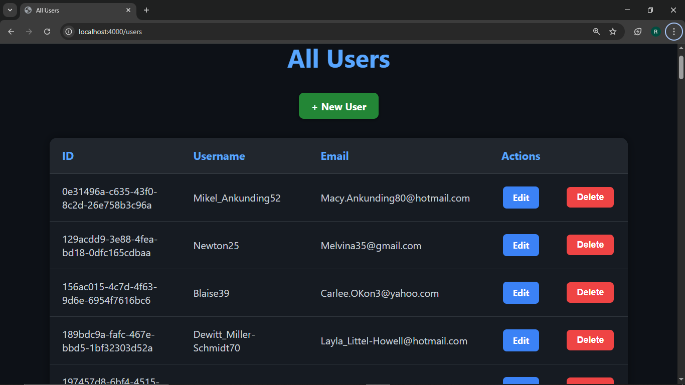
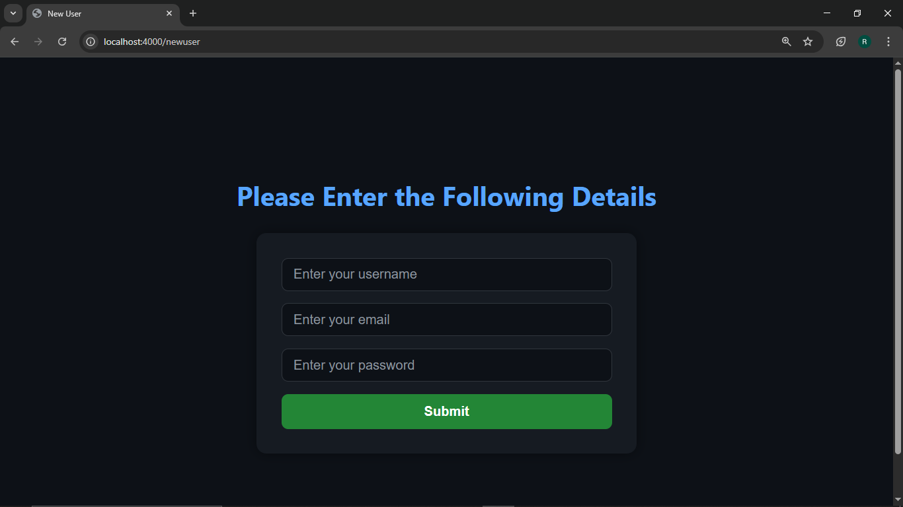

# 🧑‍💻 User Management App with Node.js, Express, and MySQL

This is a simple CRUD-based User Management application built using **Node.js**, **Express**, **MySQL**, and **EJS**. It allows you to view, edit, and update user data in a structured manner.

---

## 🚀 Features

- View total number of users
- Display all users in a styled EJS template
- Edit user email with password verification
- PATCH method implemented using method-override

---

## 📸 Screenshots

### 🏠 Home Page  
Displays the total number of users fetched from the database.



---

### 👥 User List  
All users displayed in a tabular format using EJS templating.



---

### ✏️ Edit User  
Update a user's email after verifying their password.


## 💡 Technologies Used

- Node.js
- Express
- MySQL
- EJS (Embedded JavaScript)
- method-override
- faker.js (for test data)

---

## ⚙️ Setup Instructions

1. Clone the repository:
   ```bash
   git clone https://github.com/your-username/user-management-app.git
